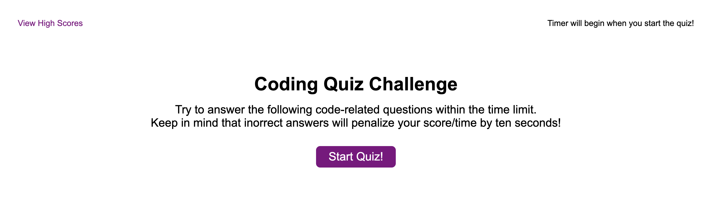

# Module Four Challenge: Code Quiz

## Purpose
The challenge this week was to create an in browser quiz. The quiz consists of multiple choice questions and is timed. This application features dynamically updated HTML and CSS that is powered by JavaScript. 

## Built With
* HTML
* CSS
* Javascript

## Website
https://lindseymiller2567.github.io/Code-Quiz/

## Contribution
Created by Lindsey Dubnicka

## Screen Shot of web page
